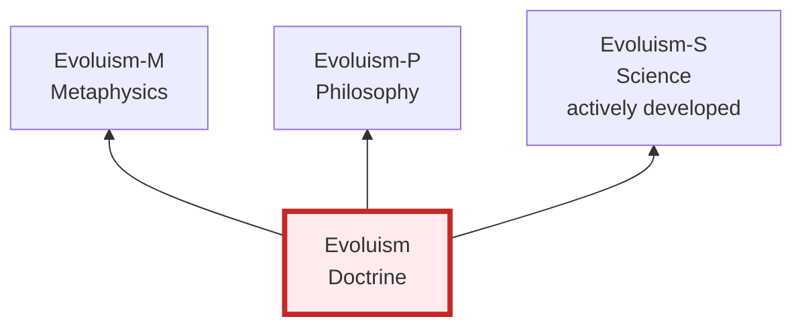

# Evoluism — Doctrine of Cognitive Evolution



→ [Evoluism-M](https://github.com/Evoluit-M/Evoluism-M) · [Evoluism-P](https://github.com/Evoluit-M/Evoluism-P) · [Evoluism-S](https://github.com/Evoluit-M/Evoluism-S)

---

# Evoluism: Three Reflections of One Reality  
**Conceptual Framework — Evoluit-M (2025)**  
*(Independent Theoretical Research Evoluism Initiative)*  

---

## 📖 Abstract

This repository contains the LaTeX source and PDF of the conceptual paper  
**“Evoluism: Three Reflections of One Reality.”**  
The work introduces the unified framework **Evoluism**, connecting three registers of understanding:

- **Metaphysical (M)** – seeks meaning and grounding  
- **Philosophical (P)** – reflects on participation and thought  
- **Scientific (S)** – measures and tests action  

The paper defines *Source*, *Flow*, and *Co-Creation* as three reflections of one evolving reality,  
offering conceptual grounding for the scientific Evoluism (S) model.

---

## 🔗 Links

- 🧠 Zenodo DOI (conceptual version):  
  [10.5281/zenodo.17547104](https://doi.org/10.5281/zenodo.17547104)

- 📊 Empirical study (Evoluism S):  
  [10.5281/zenodo.17454336](https://doi.org/10.5281/zenodo.17454336)

- 📰 Medium publication:  
  [Evoluism — Three Reflections of One Reality](https://medium.com/@evoluit-m/evoluism-three-reflections-of-one-reality-be4aa5439353)

---

## 📂 Repository Contents

```
Evoluism_Three_Reflections_of_One_Reality.tex   → LaTeX source  
Evoluism_Three_Reflections_of_One_Reality.pdf   → compiled article  
README.md                                       → this overview  
```
# Evoluism: Three Reflections of One Reality  
**Conceptual Framework — Evoluit-M (2025)**  
*(Independent Theoretical Research Evoluism Initiative)*  

---

## 📖 Abstract

This repository contains the LaTeX source and PDF of the conceptual paper  
**“Evoluism: Three Reflections of One Reality.”**  
The work introduces the unified framework **Evoluism**, connecting three registers of understanding:

- **Metaphysical (M)** – seeks meaning and grounding  
- **Philosophical (P)** – reflects on participation and thought  
- **Scientific (S)** – measures and tests action  

The paper defines *Source*, *Flow*, and *Co-Creation* as three reflections of one evolving reality,  
offering conceptual grounding for the scientific Evoluism (S) model.

---

## 🔗 Links

- 🧠 Zenodo DOI (conceptual version):  
  [10.5281/zenodo.17547104](https://doi.org/10.5281/zenodo.17547104)

- 📊 Empirical study (Evoluism S):  
  [10.5281/zenodo.17454336](https://doi.org/10.5281/zenodo.17454336)

- 📰 Medium publication:  
  [Evoluism — Three Reflections of One Reality](https://medium.com/@evoluit-m/evoluism-three-reflections-of-one-reality-be4aa5439353)

---

## 📂 Repository Contents


